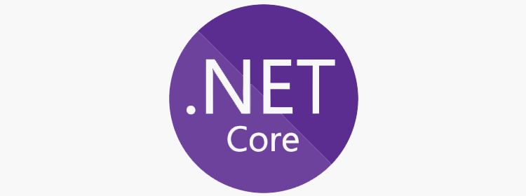

# C# 101

## Introduction

Welcome to my C# 101 repository! This collection contains various C# programs I've written while learning the language. As I'm still on my learning journey, please feel free to point out any mistakes in my code. I'm always eager to learn from feedback!

## Getting Started

Before diving in, ensure you have the necessary tools set up:

1. **Install the C# extension for Visual Studio Code.**
2. **Install the .NET SDK**: You can download it [here](https://dotnet.microsoft.com/download).

## Video Tutorials

If you prefer video tutorials, here are some links you might find helpful:

- [C# Tutorial - Full Course for Beginners](https://www.youtube.com/watch?v=GhQdlIFylQ8&t=339s)

## About C#

### Overview

C# is a general-purpose, multi-paradigm programming language developed by Microsoft. It runs on the .NET Framework and is widely used for building mobile applications, games, and enterprise software.

### Key Features

- Simple
- Modern
- Object-oriented
- Type-safe
- Scalable
- Interoperable
- Flexible
- Robust
- Secure
- Fast
- Asynchronous
- Extensible

## About .NET

.NET is a free, cross-platform, open-source developer platform. It supports building various types of applications, including web, mobile, desktop, gaming, and IoT. With .NET, you can use multiple languages, editors, and libraries.

## Creating a C# Program with .NET

To create a C# program with .NET:

1. **Install the .NET SDK**.
2. Use the `dotnet new console` command to create a new C# program in your terminal or command prompt.
3. Run the program with `dotnet run`.

## Applications of C#

C# finds applications in a wide range of fields, including:

- Mobile applications
- Games
- Enterprise software
- Web applications
- Desktop applications
- Cloud applications
- IoT applications
- Machine learning applications
- AI applications
- VR applications
- AR applications
- Mixed reality applications
- Blockchain applications
- Cryptocurrency applications
- Smart contract applications
- DApps
- And many more

